# 账号权限体系方案

> v2021-02-03

## 设计目标

### 多类型用户登录

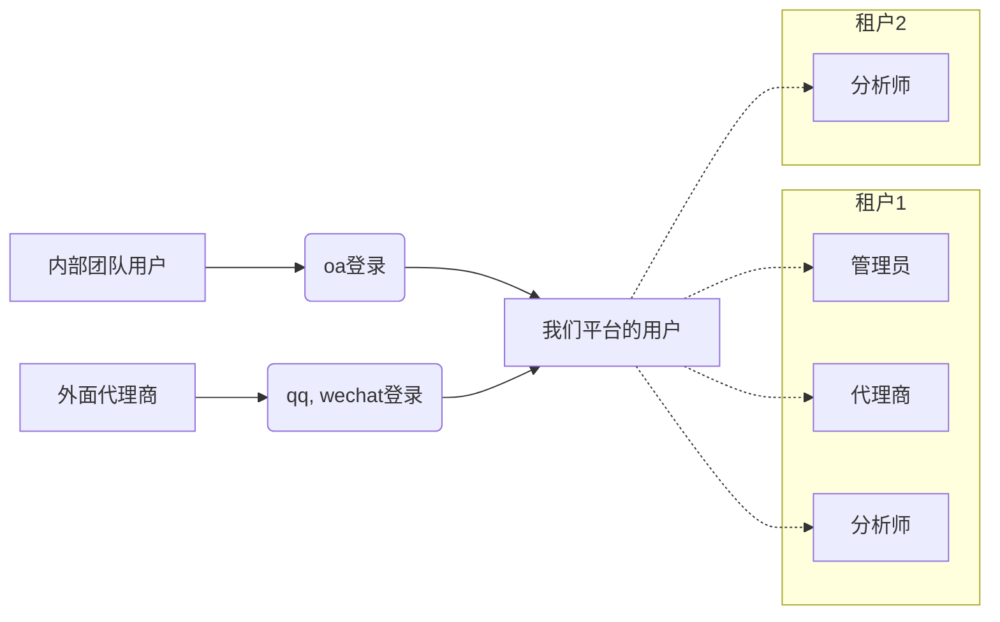

### 灵活权限控制

整体 用户-角色-实体 关系

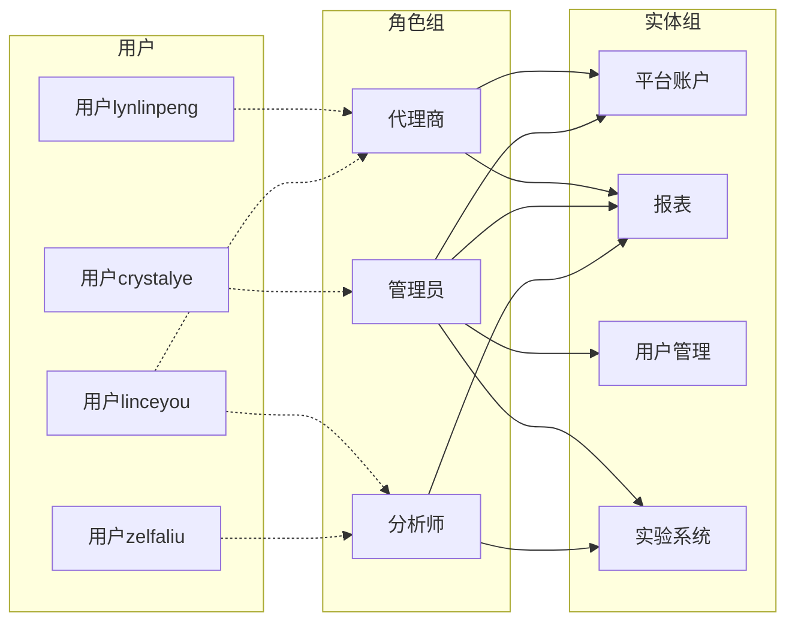

角色关系嵌套

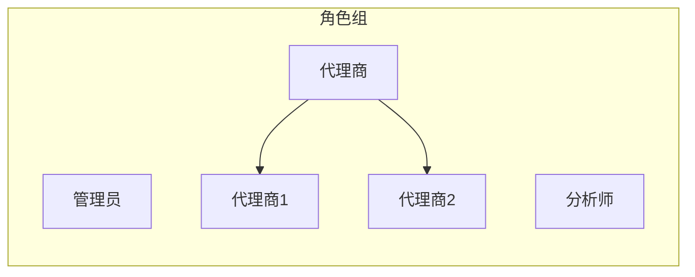

实体关系嵌套

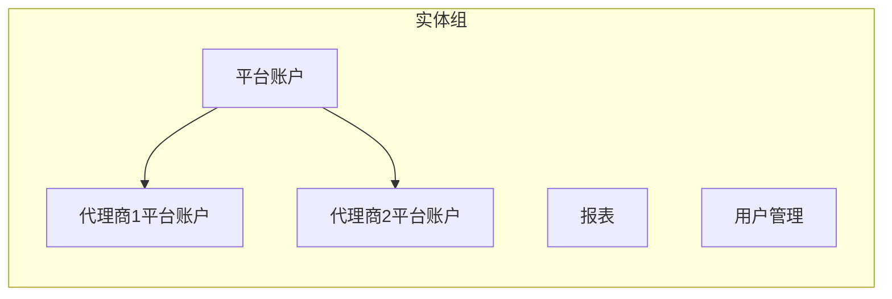

## 用户登录验证

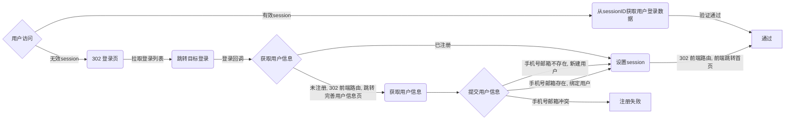

### 具体开发内容
- 页面1：登录页 `/page/portal#login`
  - 接口：拉取登录列表 `/portal/login/oauth` `GET`
  - types:
```
// RedirectLogin 单个跳转登录数据结构
type RedirectLogin struct {
   Type LoginType `json:"type"`
   Url  string    `json:"url"`
}

// RedirectLogins 跳转登录数据结构
type RedirectLogins []*RedirectLogin
```
-  后台：
  - 接口：登出 `/portal/logout` `GET`
  - 接口：登录回调接口 `/portal/login/callback/*` `GET`
- 前端路由：`/portal#proxy`
  - 参数 `redirect_type`: `dashboard`|`register`
- 页面2：完善用户信息页 `/page/portal#register`
  - 接口：提交用户信息`/portal/register` `POST`
  - 接口：获取用户登录信息 `/portal/register` `GET`
  - types: `register_user_info`
```
// RegisterUserInfo 用户注册信息数据结构
type RegisterUserInfo struct {
   PhoneNumber string `json:"phone_number" binding:"required"`
   Email       string `json:"email"        binding:"required"`
}
```
- 库表1：用户表 `user`
```
// User 用户信息
type User struct {
   ID              uint64             `gorm:"column:id;primaryKey"             json:"id,omitempty"`
   CreatedAt       time.Time          `gorm:"column:created_at"                json:"created_at,omitempty"`
   UpdatedAt       time.Time          `gorm:"column:updated_at"                json:"updated_at,omitempty"`
   DeletedAt       gorm.DeletedAt     `gorm:"column:delete_at;index"           json:"-"`
   PhoneNumber     string             `gorm:"column:phone_number;unique"       json:"phone_number,omitempty"`
   Email           string             `gorm:"column:email;unique"              json:"email,omitempty"`
   LoginUser       []*LoginUser       `gorm:"foreignKey:UserID"                json:"login_user,omitempty"`
   ExperimentGroup []*ExperimentGroup `gorm:"many2many:user_experiment_groups" json:"experiment_group,omitempty"`
}
```
- 库表2：登录用户表 `login_user`
```
// LoginUser 用户的登录信息
type LoginUser struct {
   OpenID    string         `gorm:"column:open_id;primaryKey"    json:"open_id,omitempty"`
   LoginType LoginType      `gorm:"column:login_type;primaryKey" json:"login_type,omitempty"`
   CreatedAt time.Time      `gorm:"column:created_at"            json:"created_at,omitempty"`
   UpdatedAt time.Time      `gorm:"column:updated_at"            json:"updated_at,omitempty"`
   DeletedAt gorm.DeletedAt `gorm:"column:delete_at;index"       json:"-"`
   UserID    uint64         `gorm:"column:user_id"               json:"user_id,omitempty"`
   Avatar    string         `gorm:"column:avatar"                json:"avatar,omitempty"`
   NickName  string         `gorm:"column:nick_name"             json:"nick_name,omitempty"`
}
```

## 页面的权限控制

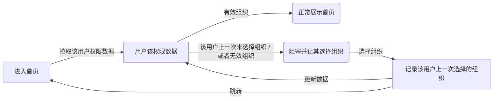

### 具体开发内容

- 页面3：首页 `/page/dashboard`
  - 接口：拉取该用户数据 `/dashboard/user/info` `GET`
  - 接口：编辑用户信息 `/dashboard/user/info` `POST`
  - 接口：编辑用户信息 `/dashboard/user/tenant` `POST`
  - 接口：拉取该用户权限数据 `/dashboard/user/authority` `GET`
  - 接口：搜索用户信息 `/dashboard/user/search` `POST`
  - types: `authority`结构  **(TODO)**
     - 前端页面权限结构（待定）
  - types: `user_info`结构
```
// UserInfo 用户信息数据结构
type UserInfo struct {
   User          *User      `json:"user"`
   LoginUser     *LoginUser `json:"login_user"`
   CurrentTenant *Tenant    `json:"current_tenant"`
   Tenant        []*Tenant  `json:"tenant"`
}
```
  - types: `user_search`数据结构
```
// UserSearch 用户搜索数据结构
type UserSearch struct {
   PhoneNumber string `json:"phone_number"`
   Email       string `json:"email"`
   NickName    string `json:"nick_name"`
   Approximate bool   `json:"approximate"`
}
```

## 权限设计和管理

### RBAC权限设计

[RBAC设计原理](https://casbin.org/docs/zh-CN/rbac-with-domains)

支持域/租户，并且支持用户和资源可以同时具有角色 (或组) 的 cabin 模型定义

```ini
[request_definition]
r = sub, dom, obj, act

[policy_definition]
p = sub, dom, obj, act

[role_definition]
g = _, _, _
g2 = _, _, _

[policy_effect]
e = some(where (p.eft == allow))

[matchers]
m = g(r.sub, p.sub, r.dom) && g2(r.obj, p.obj, r.dom) && r.dom == p.dom && r.act == p.act || g(r.sub, "superadmin", "superdomain")
```

policy定义

```csv
p, admin, domain1, data1, read
p, admin, domain2, data2, read
p, data_group_admin, domain2, data_group, write

g, alice, admin, domain1
g, alice, data_group_admin, domain2
g2, data2, data_group, domain2
g2, data3, data_group, domain2

g1, slyao, superadmin, superdomain
```

实际结果

| 用户 | 租户 | 实例 | 动作 | 是否有权限 |
| --- | --- | ---  | --- | --- |
| alice | domain1 | data1 | read | true |
| alice | domain1 | data2 | read | false |
| alice | domain2 | data2 | read | false |
| alice | domain2 | data2 | write | true |
| alice | domain2 | data3 | write | true |
| slyao | domain2 | data3 | data3 | true |

概念图

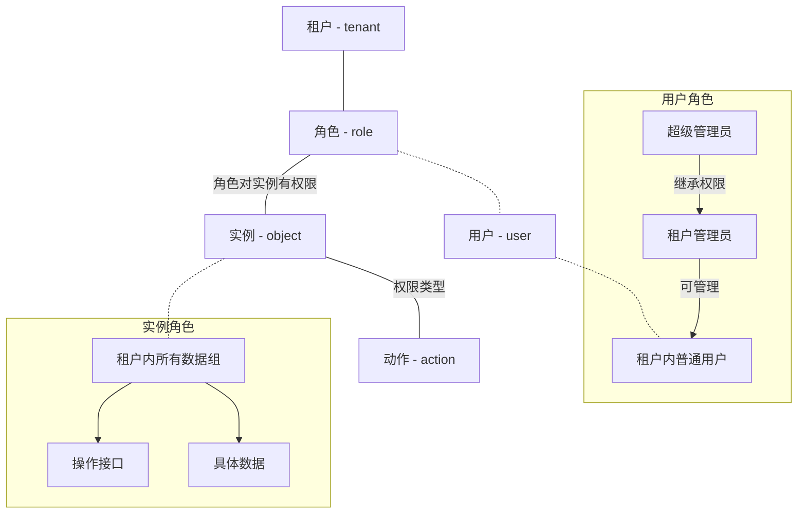

### 权限管理使用流程

创建租户

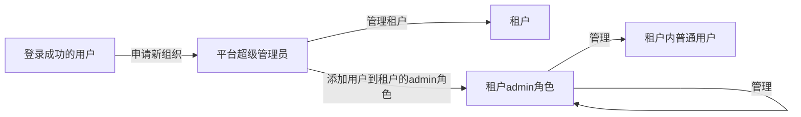

用户管理

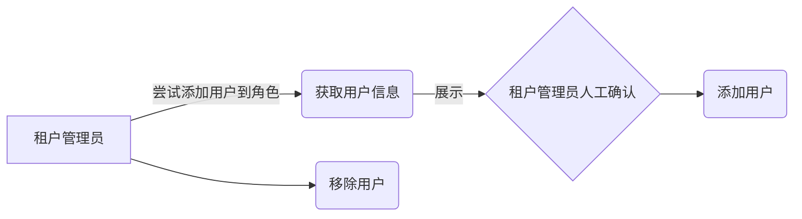

### 具体开发内容

- 页面4-1：租户管理页 `/page/dashboard#management/tenant`
  - 接口：拉取所有租户信息列表 `/dashboard/management/tenant` `GET`
  - 接口：新增或者编辑租户信息 `/dashboard/management/tenant` `POST`
  - 接口：删除某个租户 `/dashboard/management/tenant/:id` `DELETE`
  - types: `tenant`结构
- 库表3：租户表 `tenant`
```
// Tenant 租户信息
type Tenant struct {
   ID        uint64         `gorm:"column:id;primaryKey"   json:"id,omitempty"`
   CreatedAt time.Time      `gorm:"column:created_at"      json:"created_at,omitempty"`
   UpdatedAt time.Time      `gorm:"column:updated_at"      json:"updated_at,omitempty"`
   DeletedAt gorm.DeletedAt `gorm:"column:delete_at;index" json:"-"`
   Name      string         `gorm:"column:name"            json:"name"`
}
```

- 页面4-2：超级管理员页 `/page/dashboard#management/superadmin`
  - 接口：拉取超级管理员列表 `/dashboard/management/superadmin` `GET`
  - 接口：新增超级管理员信息 `/dashboard/management/superadmin` `POST`
  - 接口：删除某个超级管理员 `/dashboard/management/superadmin/:id` `DELETE`
  - types: `user`结构, `user_search`数据结构

- 页面4-3：页面实体管理页 `/page/dashboard#management/frontend`
  - 接口：拉取页面实体列表 `/dashboard/management/frontend` `GET`
  - 接口：新增页面实体信息 `/dashboard/management/frontend` `POST`
  - 接口：删除某个页面实体 `/dashboard/management/frontend` `DELETE`
  - types: `frontend`结构 **(TODO)**

- 页面4-4：后台API管理页 `/page/dashboard#management/backend`
  - 接口：拉取页面实体列表 `/dashboard/management/backend` `GET`
  - 接口：新增页面实体信息 `/dashboard/management/backend` `POST`
  - 接口：删除某个页面实体 `/dashboard/management/backend` `DELETE`
  - types: `backend`结构 **(TODO)**

- 页面5-1：组织信息页 `/page/dashboard#organization/info`
  - 接口：拉取组织信息 `/dashboard/organization/info` `GET`
  - types: `organization`结构，基本同`tenant`

- 页面5-2：用户管理页 `/page/dashboard#organization/user`
  - 目的是管理g1中的用户
  - 接口：拉取用户视角对应的角色数据的列表  `/dashboard/organization/user` `GET`
  - 接口：更新一个用户对应的角色数据 `/dashboard/organization/user` `POST`
  - 接口：删除一个用户对应的角色数据 `/dashboard/organization/user/:id` `DELET`
  - types: `user`数据结构，casbin表示`user`权限的数据结构 **(TODO)**

- 页面5-3：角色管理页 `/page/dashboard#organization/role`
  - 目的是管理g1中角色组
  - 接口：拉取角色视角对应的用户数据的列表 `/dashboard/organization/role` `GET`
  - 接口：更新一个角色对应的关联和用户数据 `/dashboard/organization/role` `POST`
  - 接口：删除一个角色对应的关联和用户数据 `/dashboard/organization/user/:id` `DELET`

- 页面5-4：数据实体管理页 `/page/dashboard#organization/object`
  - 目的是管理g2中的数据实体
  - 接口：拉取实体数据 `/dashboard/organization/object` `GET`
  - 接口：更新实体数据 `/dashboard/organization/object` `POST`

- 页面5-5：权限策略管理页 `/page/dashboard#organization/policy`
  - 目的是管理p
  - 接口：拉取可选实体全集 `/dashboard/organization/object/all` `GET`
  - 接口：拉取角色对应的实体数据的列表 `/dashboard/organization/policy` `GET`
  - 接口：更新一个角色对应的实体数据 `/dashboard/organization/policy` `POST`
  - types: `user`数据结构，casbin表示`user`权限的数据结构 **(TODO)**

## 平台帐号授权

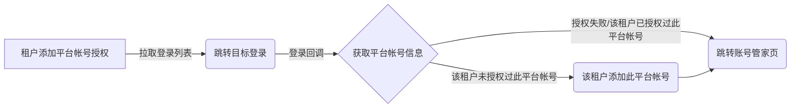

### 具体开发内容

- 页面6：账号管家页 `/page/dashboard#account`
  - 接口：拉取已经授权平台帐号列表 `/dashboard/account/list` `get`
  - 接口：拉取各平台授权接口列表 `/dashboard/account/oauth` `get`
  - 接口：删除已经授权平台帐号列表 `/dashboard/account/delete` `post`
  - types: `account`
-  后台：
  - 接口：平台授权回调接口 `/dashboard/account/callback/*` `get`
- 库表4：平台帐号表 `account` **(TODO)**

## 后台API权限验证

基础方案：API ID + API Sercet方式

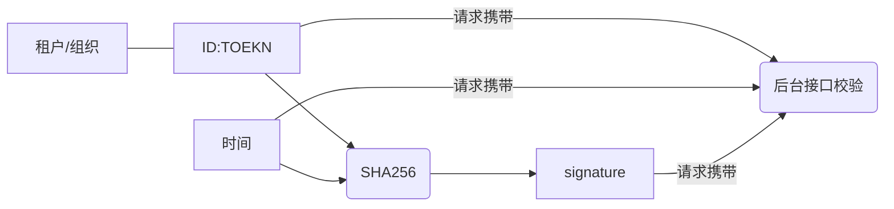

其他方案：Oauth 或者 JWT的实现方式（待定）

### 具体开发内容
- 后台接口升级`/api/v1`，增加校验逻辑
- 租户表 `tenant` 包含生成 `token`
